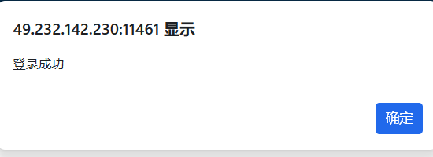
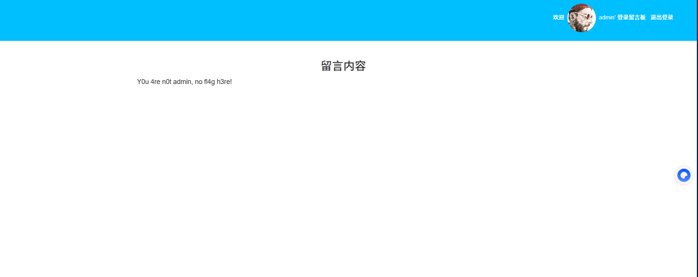
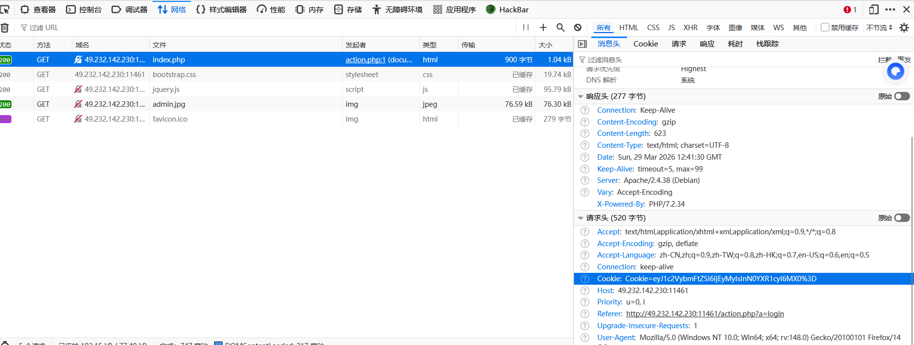
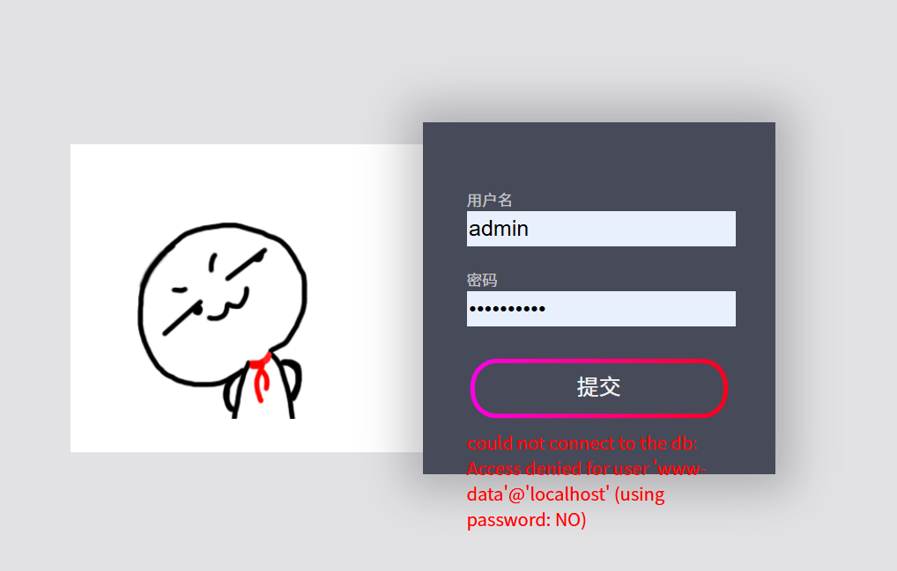
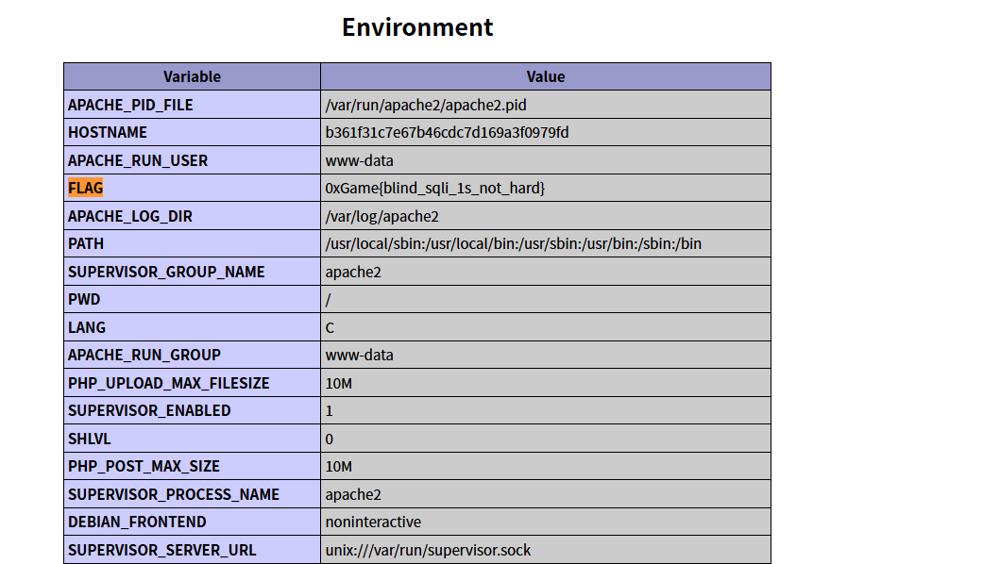

# 2026.3.29 Web wp

### 练习平台：bugku     练习人：樊亦暄

### 1.cookies（[0xGame](https://ctf.bugku.com/challenges/index/gid/2/tag/139.html) [2020](https://ctf.bugku.com/challenges/index/gid/2/tag/140.html)）

靶机：[http://49.232.142.230:11461](http://49.232.142.230:11461/)

思路：

1.输入用户名admin    密码123

2.输入1  密码1

显示登录成功，进入网页



显示**Y0u 4re n0t admin, no fl4g h3re!**

提示在用户admin的留言版里面会有flag

3.想起来题目的提示cookie，所以我们打开了开发者工具，随便输入了用户名与密码，打开网页，找到了cookie

```
键值对结构	一个Cookie由一个名字和一个值组成。	username=Alice
```



4.

```
Cookie=eyJ1c2VybmFtZSI6IjEyMyIsInN0YXR1cyI6MX0%3D
```

（1）**%3D**是url编码，即**=**

（2）那这个cookie就是

```
eyJ1c2VybmFtZSI6IjEyMyIsInN0YXR1cyI6MX0=
```

即是base64编码，解开编码后

```
{"username":"123","status":1}
```

5.想到前面提示，用户名需要是admin，构造一个语句

```
{"username":"admin","status":1}
```

base64编码为：

```
eyJ1c2VybmFtZSI6ImFkbWluIiwic3RhdHVzIjoxfQ==
```

6.用bp，在登录成果界面，修改cookie


得到flag

```
0xGame{b3c48a2f54bb49c60a0d08bf6a7962e3}
```

### 2.close eyes([0xGame](https://ctf.bugku.com/challenges/index/gid/2/tag/139.html) [2020](https://ctf.bugku.com/challenges/index/gid/2/tag/140.html))

靶机：[http://49.232.142.230:11098](http://49.232.142.230:11098/)

思路：

1.不管输入什么，都会显示这个**could not connect to the db: Access denied for user 'www-data'@'localhost' (using password: NO)**

```
这个错误表明应用程序尝试连接数据库时，使用了错误的认证信息
```



因此它**没有使用正确的数据库配置**

2.下一步我们应该搜集信息，打开direasech，扫出来了几个文件

3.每一个都去找有无关键字flag，在phpinfo.php中找到



4.得到答案

```
	0xGame{blind_sqli_1s_not_hard}
```

# 题后总结

## （一）扫描文件

### 1.Web 服务的「路径映射」机制

在 HTTP 协议里，**网址（URL）本质是服务器文件 / 资源的路径映射**，浏览器访问 URL 时，Web 服务器会把 URL 路径对应到服务器上的真实文件或目录。

服务器收到请求后，会去指定目录（比如 `/var/www/html/`）找到 `config.php` 并执行 / 返回给浏览器

#### （1）静态文件直接对应：`.html`/`.css`/`.js`/`.jpg` 等静态资源：URL 路径几乎和服务器文件路径一一对应

#### （2）动态脚本文件：`.php`/`.asp`/`.jsp` 等动态脚本：本质也是服务器上的可执行文件，只是访问时会被服务器解析执行。

**敏感文件暴露**：像 `config.php`、`phpinfo.php` 这类本不该对外暴露的文件，会被直接通过 URL 访问，泄露数据库密码、环境信息等核心数据。

`config.php`：可能包含数据库账号密码、密钥等核心配置。

`phpinfo.php`：泄露 PHP 版本、环境变量、编译参数等，是寻找漏洞的重要依据。

`backup.zip`/`.git`：可能泄露完整源码，直接拿到解题线索。

## （二）direasech的使用

```
python dirsearch.py -u http://xxxx        //日常使用

python dirsearch.py -u http://xxxx -r        //递归扫描，不过容易被检测

python dirsearch.py -u http://xxxx -r -t 30        //线程控制请求速率

python dirsearch.py -u http://xxxx -r -t 30 --proxy 127.0.0.1:8080        //使用代理

```

