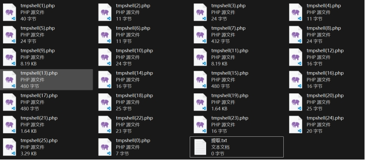
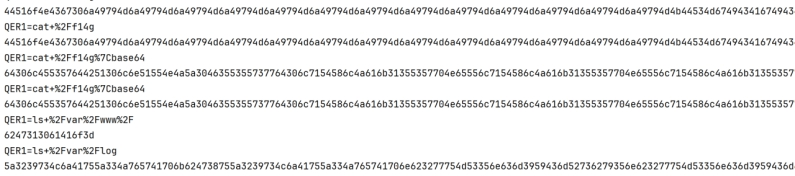
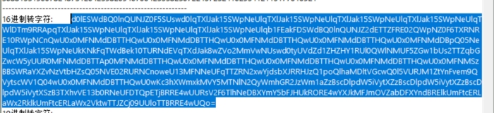
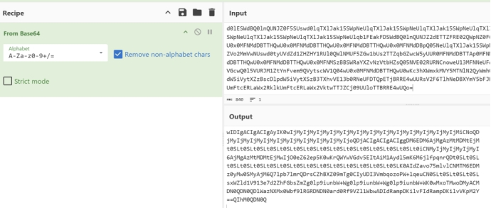

1、流量包导出http流---找到关键流量

2、对http流内容分析---编写脚本将所有包数据提取

3、对字符串进行分析得到flag---16进制串+base64倒转

 

 

打开流量包导出http对象

 

 

打开文件后全是16进制编码，使用代码提取

 

Exp:
data=""
for i in range(26):
  file_path=fr"C:\Users\asus\OneDrive\Desktop\真实的压缩包\真实的压缩包\tmpshell({i}).php"
  with open(file_path,'r')as f1:
    data=f1.read()
    print(data)

 

 

 

将数据复制到提取.txt文件中

 

对所有的字符串分析后发现flag在这一段中

 

 

16进制串转字符后是一段base64编码

 

 

Base64之后还是一段base64编码，这里需要将字符串倒置后编码（左右反转）

 

 

解出来后按照指令拼接字符串flag{Welc0me_GkC4F_m1siCCCCCC!}