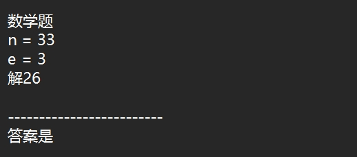
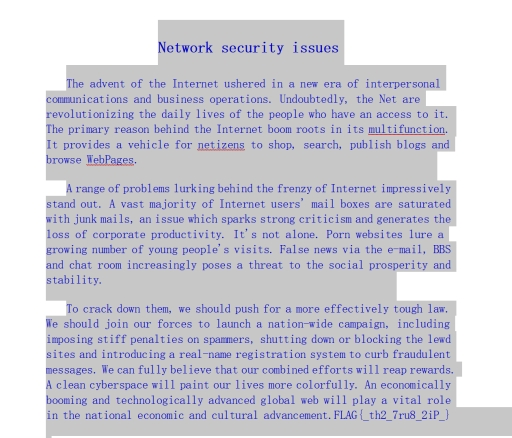

1、RSA解密得到密码--密码是5

2、Jpg图片恢复高度得到加密线索--异或5（^5）

3、对加密文件实行反加密--python程序实现

4、还原文件后找到文件格式--docx文件隐写得到flag

 

 
RSA加密解开后为5---密码为5

 

揭开后使用随波逐流对图片分析

 

直接得到修复后高度的jpg图片以及下一阶段线索--异或5

 

对文件“亦真亦假”进行异或操作

Exp:

import binascii
with open(r'C:\Users\asus\OneDrive\Desktop\真实的压缩包\亦真亦假','r')as f1:
  data=f1.read()
flag_data=""
for i in data:
  tmp=int(i,16)^5  #16进制转为10进制
  flag_data+=hex(tmp)[2:]  #去掉前缀0x
with open(r'C:/Users/asus/OneDrive/Desktop/flag.txt','wb')as f2:
  f2.write(binascii.unhexlify(flag_data))
print("Decryption complete.")

 

Txt文件打开后发现是docx文件

 

全选后修改字体颜色得到flag--FLAG{_th2_7ru8_2iP_}

