目录

[[GUET-CTF2019\]虚假的压缩包 --buu ](#_Toc31521 )

[[GKCTF 2021\]签到 --buu ](#_Toc1912 )

[[SWPU2019\]你有没有好好看网课? ——buu ](#_Toc2127 )

 


## ***\*[GUET-CTF2019]虚假的压缩包\**** ***\*--buu\****

1、RSA解密得到密码--密码是5

2、Jpg图片恢复高度得到加密线索--异或5（^5）

3、对加密文件实行反加密--python程序实现

4、还原文件后找到文件格式--docx文件隐写得到flag

 

 

RSA加密解开后为5---密码为5

 

揭开后使用随波逐流对图片分析

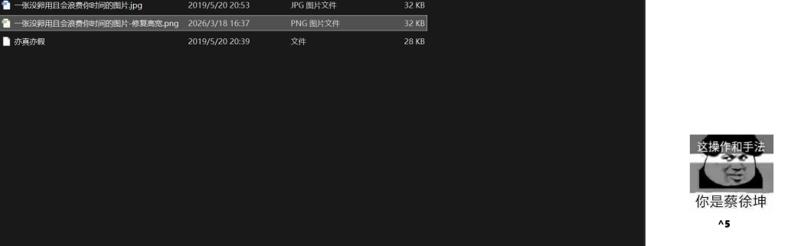 

直接得到修复后高度的jpg图片以及下一阶段线索--异或5

 

对文件“亦真亦假”进行异或操作

Exp:

import binascii
with open(r'C:\Users\asus\OneDrive\Desktop\真实的压缩包\亦真亦假','r')as f1:
  data=f1.read()
flag_data=""
for i in data:
  tmp=int(i,16)^5  #16进制转为10进制
  flag_data+=hex(tmp)[2:]  #去掉前缀0x
with open(r'C:/Users/asus/OneDrive/Desktop/flag.txt','wb')as f2:
  f2.write(binascii.unhexlify(flag_data))
print("Decryption complete.")

 

Txt文件打开后发现是docx文件

 

全选后修改字体颜色得到flag--

```
FLAG{_th2_7ru8_2iP_}
```


## ***\*[GKCTF 2021]签到\**** ***\*--buu\****

1、流量包导出http流---找到关键流量

2、对http流内容分析---编写脚本将所有包数据提取

3、对字符串进行分析得到flag---16进制串+base64倒转

 

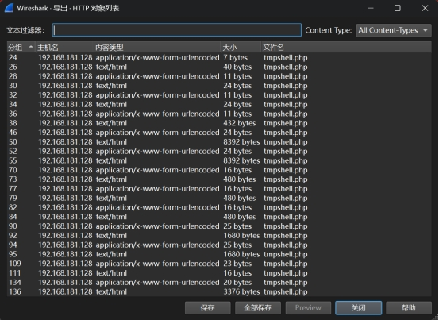 

打开流量包导出http对象

 

 

打开文件后全是16进制编码，使用代码提取

 

Exp:
data=""
for i in range(26):
  file_path=fr"C:\Users\asus\OneDrive\Desktop\真实的压缩包\真实的压缩包\tmpshell({i}).php"
  with open(file_path,'r')as f1:
    data=f1.read()
    print(data)

 

 

 

将数据复制到提取.txt文件中

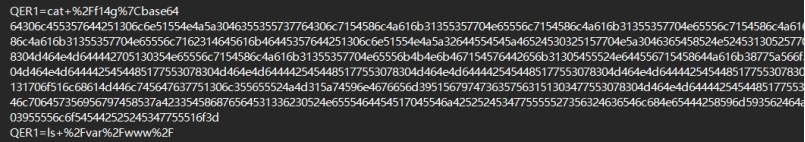 

对所有的字符串分析后发现flag在这一段中

 

 

16进制串转字符后是一段base64编码

 

 

Base64之后还是一段base64编码，这里需要将字符串倒置后编码（左右反转）

 

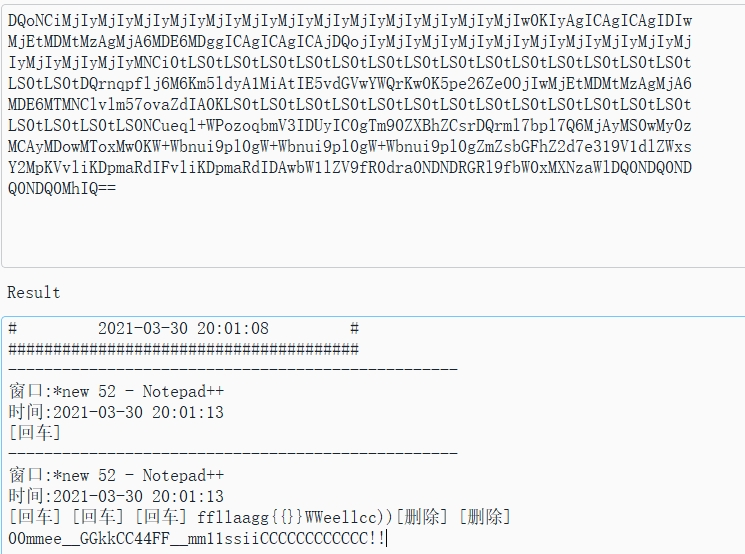 

解出来后按照指令拼接字符串

```
flag{Welc0me_GkC4F_m1siCCCCCC!}
```


## ***\*[SWPU2019]你有没有好好看网课?\**** ***\*——buu\****

1、压缩包注释获取zip1密码线索

2、docx获取mp4视频段线索得到两个编码

3、破解编码得到zip2密码

4、zip2通过010找到flag

 

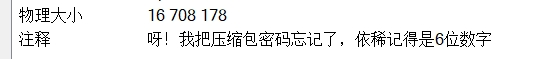 

找到密码线索，直接爆破得到密码888866

 

打开后得到docx和mp4文件

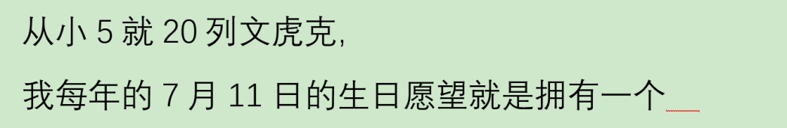 

Docx文件得到两个数字线索5.20以及7.11

 

分别在视频的两个时间上得到两个编码

1、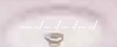2、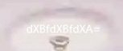

第一段对点数切分52 31 31 32使用敲击吗得到wllm

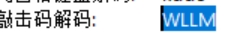 

第二段base加密得到up_up_up

 

拼接后得到密码wllmup_up_up解开第二个压缩包

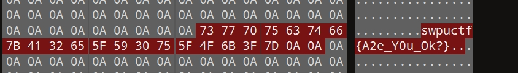 

拖进010找到flag

```
swpuctf{A2e_Y0u_Ok?}
```

 

## [WUSTCTF2020]alison_likes_jojo   --buu

1、图片提取zip压缩包    --随波逐流foremost

2、爆破压缩包得到文件   --archpr得到密码888866

3、打开文件得到base64编码   --解密得到密钥killerqueen

4、outguess破解得到flag


第一张图片打开发现藏了一个压缩包，使用foremost提取出来

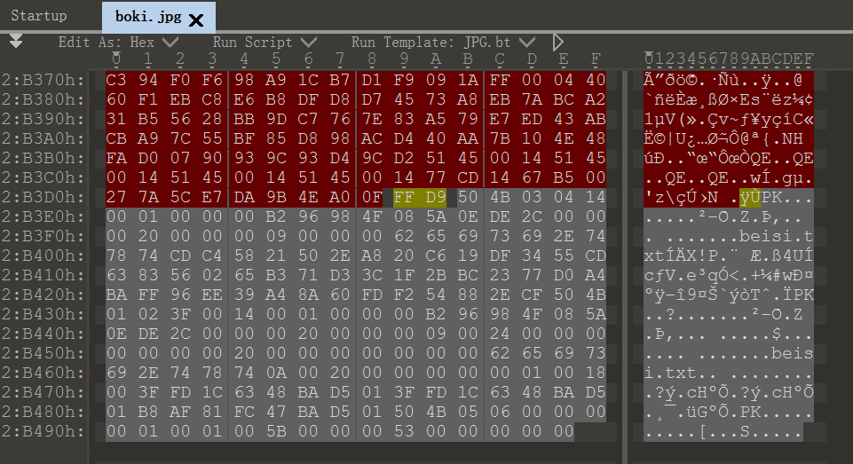 


提取后发现有密码，使用ARCHPR破解得到密码888866

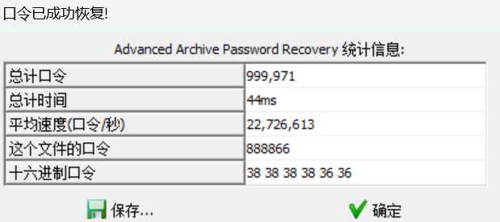 


打开后是一段base64编码 

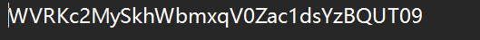 

烘焙一下

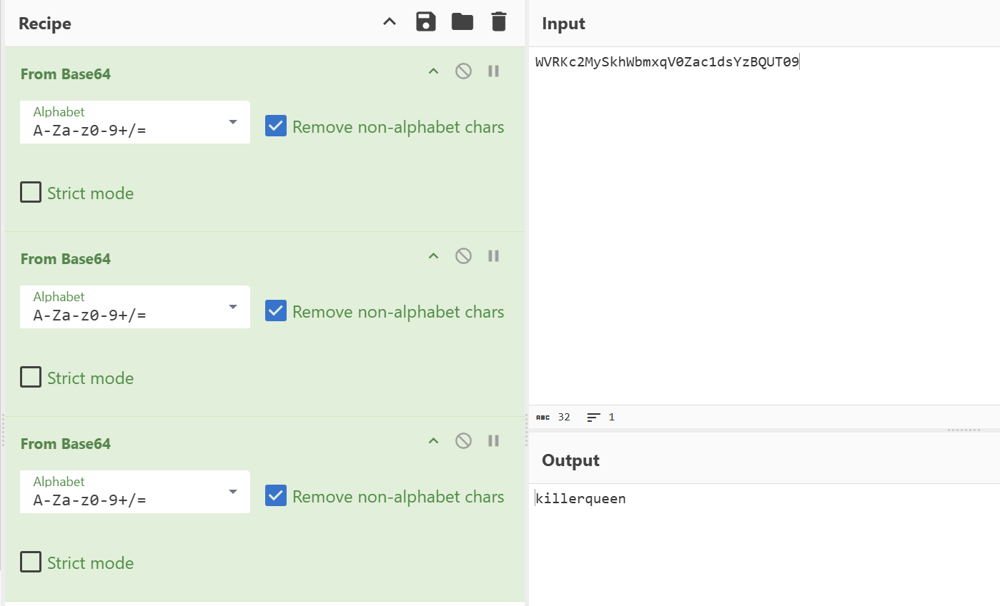 

得到一个密钥killerqueen

然后对第二个图片操作


> **带有密钥的图片隐写包含**
>
> 1. steghide
> 2. outguess(wsl)
> 3.  F5 Steganography

 这里一个个尝试最后是outguess破解得到flag

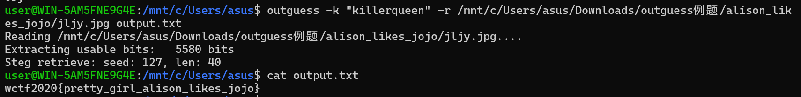 

 wctf2020{pretty_girl_alison_likes_jojo}


## -++-  [NUAACTF](https://ctf.bugku.com/challenges/index/gid/2/tag/104.html) [2017]

1、给了一串( ͡° ͜ʖ ͡°)fuck   --转BF编码

2、BF编码中-.互换  --得到flag

文件中直接给出( ͡° ͜ʖ ͡°)fuck编码，这里需要对应[( ͡° ͜ʖ ͡°)fuck - Esolang](https://esolangs.org/wiki/(_͡°_͜ʖ_͡°)fuck)网站然后将其转换为BF编码

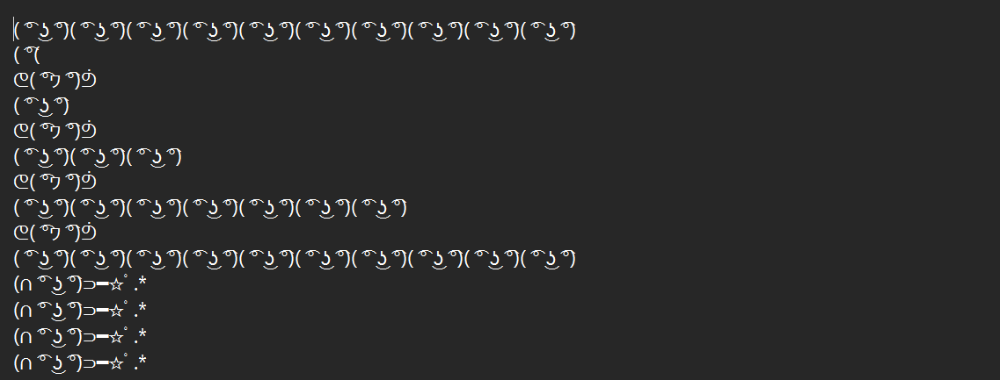 

对照一下对对应表之后得到相应编码

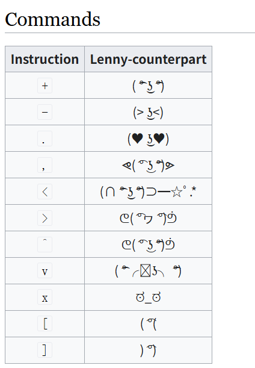 

```
++++++++++[>+>+++>+++++++>++++++++++<<<<.]>>>>++++++++++-+++++++-....................--++-+++++++++++++++++-..............-+++++++++++++++++++++-.........................-++++++++++++++++-<..................-...->....-........-+++++++++++++++-..................-++++++++-............-+++++++++++++++++-<->+++++-..-++++++++++-
```

但是这个编码其实无法直接解开来，需要将.-进行交换

```
对于BF编码，一般可能会有如下规律
1、+-一般是最多的
2、[]是对称的
3、<>.,一般比较是
```

而这题中，.的数量非常多，-却很少

```
转换后：
++++++++++[>+>+++>+++++++>++++++++++<<<<-]>>>>++++++++++.+++++++.--------------------..++.+++++++++++++++++.--------------.+++++++++++++++++++++.-------------------------.++++++++++++++++.<------------------.---.>----.--------.+++++++++++++++.------------------.++++++++.------------.+++++++++++++++++.<.>+++++.--.++++++++++.
```

最后解出来：

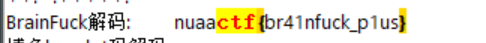 

```
nuaactf{br41nfuck_p1us}
```


## 3-dewas --网鼎杯2018

1、根据wasd描绘图像得到flag

给的全是wsad

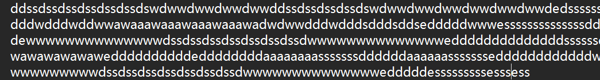 

使用代码描绘出轨迹wsad分别对应上下左右

```
EXP：
import turtle

# 你的 WASD 字符串
s = "ddssdssdssdssdssdssdswdwwdwwdwwdwwddssdssdssdssdswdwwdwwdwwdwwdwwdwwdedsssssssssssssedwdwwdwwdwwdwwdwwdwwddssdssdssdsaaaaaaaaddddddddsdssdssdsdedwwwedsddsdddsddddwdddwddwwawaaawaaawaaawaaawadwdwwdddwdddsdddsddsedddddwwwessssssssssssssddddwdddwddwddwddwdwwdwawwaawaawaawaaawaaaaeddddddddddddddddddesssssssssssssseddddddewwwwwwwwwwwwwwdssdssdssdssdssdssdssdwwwwwwwwwwwwwweddddddddddddddssssssewwawwawawaaasasassasssassdsssdsddsddddwdwwdwwwaaaeddddddssssssewdwdwdwdwdwdwdawawawawawawaweddddddddddeddddddddaaaaaaaasssssssddddddaaaaaassssssseddddddddddddwwwwwwwwwwwwwwessssssssssdssdsddsdddwddwdwwdwwwwwwwwwwedddddssssssssssssssewwwwwwwwwwwwwwdssdssdssdssdssdssdssdwwwwwwwwwwwwwwedddddesssssssssesssess"

# 窗口大小固定，防止乱跑
screen = turtle.Screen()
screen.setup(800, 600)
screen.title("WASD 轨迹（缩小版）")

t = turtle.Turtle()
t.speed(0)
t.pensize(1)
t.color("blue")

# 每步只走 1 像素，超级小
step = 1

for c in s.lower():
    if c == 'w':
        t.setheading(90)
        t.forward(step)
    elif c == 's':
        t.setheading(270)
        t.forward(step)
    elif c == 'a':
        t.setheading(180)
        t.forward(step)
    elif c == 'd':
        t.setheading(0)
        t.forward(step)

turtle.done()
```

画完后得到如下图

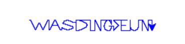 

```
flag{WASDINGFUN}
```


## 3-mirrorMISC  [网鼎杯](https://ctf.bugku.com/challenges/index/gid/2/tag/145.html) [2018](https://ctf.bugku.com/challenges/index/gid/2/tag/146.html)

1、010提取文件后面字节

2、将文件字节倒转得到图片


文件直接使用随波逐流提取出来后，导入16进制

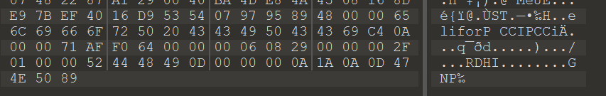 

在文件末端可以看到其实是%png的到徐，我们使用代码将其倒转回来

```python
EXP:
    def reverse_hex_file(input_path, output_path):
    # 读取文件原始字节
    with open(input_path, "rb") as f:
        data = f.read()
    
    # 字节倒序（核心一行）
    reversed_data = data[::-1]
    
    # 写入新文件
    with open(output_path, "wb") as f:
        f.write(reversed_data)
    
    print(f"✅ 倒序完成！")
    print(f"原文件长度：{len(data)} 字节")
    print(f"倒序后保存到：{output_path}")

# ======================
# 在这里设置你的文件路径
# ======================
input_file = r"C:\Users\asus\Downloads\file (3)\flag_end"    # 你要倒序的文件
output_file = r"C:\Users\asus\Downloads\file (3)\flag_reversed.png" # 倒序后的新文件

reverse_hex_file(input_file, output_file)
```

得到的文件打开来就是
 

```
flag{Mirr0r_R3f3ct1on_H1dd3n_f14g}
```


## Lipstick  [N1CTF](https://ctf.bugku.com/challenges/index/gid/2/tag/108.html) [2018](https://ctf.bugku.com/challenges/index/gid/2/tag/109.html)

1、使用lsb-BGR通道提取压缩包

2、对照片进行BGR提取

3、对21个RGB数据转16进制

4、对找YSL色号表找到21个16进制数的色号

5、将21个色号转为二进制数后拼接

6、将拼接后的二进制串8个一组转为字节形式

7、将最后的字节进行uft-8编码


先将图片拖进随波逐流发现flag字样

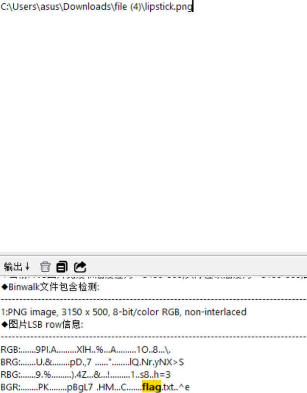 

说明在BGR通道中存在lsb隐写

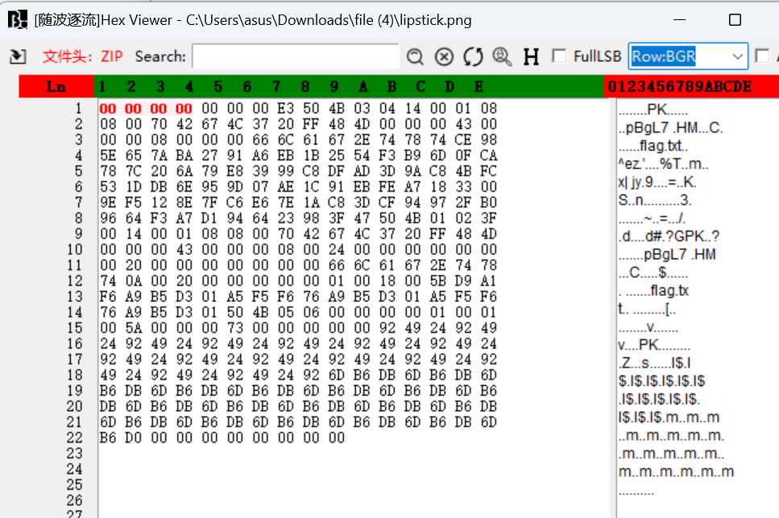 

导出来后保存，然后使用binwalk提取出来，打开后发现有密码


使用爆破以及伪加密后未发现任何线索，猜测线索可能还在原来的图片中，我们再次打开图片

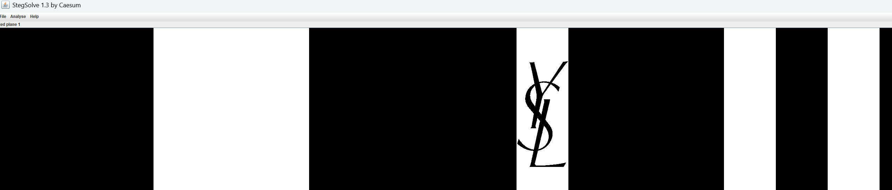 

发现在lsb图片中还藏有YSL字样

加上图片本身内容以及图片名称Lipstick-口红，猜测这里是需要将图片中的颜色对应YSL中的口红色号

 

图片中有21个色号，我们使用随波逐流直接提取RGB值

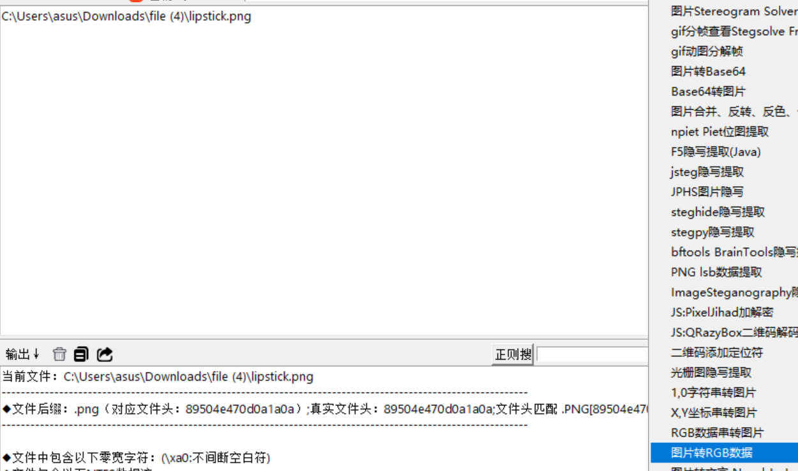 


将所有的RGB数据整理后得到如下21个结果

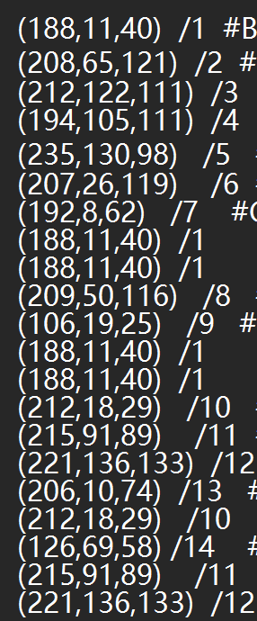 

然后使用网站[RGB颜色值与十六进制颜色码转换工具](https://www.sioe.cn/yingyong/yanse-rgb-16/)得到这些RGB值对应的16进制值

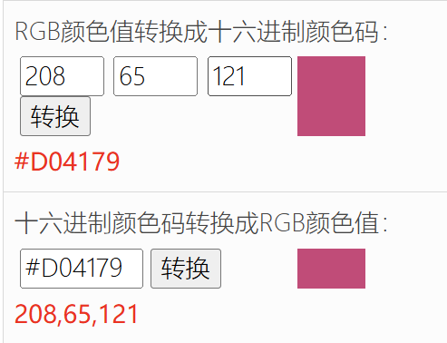 

依次读取后得到的字符串如下

```python
BC0B28 D04179 D47A6F C2696F EB8262 CF1A77 C0083E BC0B28 BC0B28 D13274 6A1319 BC0B28 BC0B28 D4121D D75B59 DD8885 CE0A4A D4121D 7E453A D75B59 DD8885
```


> [!IMPORTANT]
>
> 接下来就是断掉了的一步：
> 我看了网上的能找到的wp,里面有用代码或者说直接转为二进制字符串的，但是都是目前无法实现的
>
> 1、给的代码wrl接入网站寻找色号，但是现在的色号已经和原来的色号不同了，给的网址也显示的和原来不一样了，当前的YSL官网中也没有看到有关这一题中需要的色号
>
> 2、说将这个转为二进制字符串也是复现不了的，因为这个连对应的长度都不一样

原来的步骤，对于这里的对应关系应该是有如下的关系（除了看其他的题解，或者一些其他的记载，才可能再找到这个对应关系）

```python
原16进制串
str1=[BC0B28 D04179 D47A6F C2696F EB8262 CF1A77 C0083E BC0B28 BC0B28 D13274 6A1319 BC0B28 BC0B28 D4121D D75B59 DD8885 CE0A4A D4121D 7E453A D75B59 DD8885]
对应的色号如下
str2=[1, 27, 59, 11, 23, 7, 57, 1, 1, 76, 222, 1, 1, 50, 214, 6, 77, 50, 53, 214, 6]
```

拿到这21个色号之后将其转为二进制，然后再8个一组转为字节的形式进行UTF-8的编码就行

> [!IMPORTANT]
>
> 这里不需要对对位数进行补0，只需要进行最简单的转换就行
>
> 例如：1直接转为1，而不是0001或者0000 0001
>
> 27转为11011而不是0000 0001

```python
EXP：
color_numbers = [1, 27, 59, 11, 23, 7, 57, 1, 1, 76, 222, 1, 1, 50, 214, 6, 77, 50, 53, 214, 6]

binary_string = ''.join([bin(num)[2:] for num in color_numbers])
print(f"二进制字符串: {binary_string}")
# 转换
bytes_data = bytes([int(binary_string[i:i+8], 2) for i in range(0, len(binary_string), 8)])

#ef bb bf e7 99 bd e5 ad a6 e5 ae b6
hex_str = bytes_data.hex()
# 转换为字节
byte_data = bytes.fromhex(hex_str)
print(f"字节数据: {byte_data}")
# 尝试UTF-8解码
result = byte_data.decode('utf-8')
print(f"解码结果: {result}")
```

最后得到密码

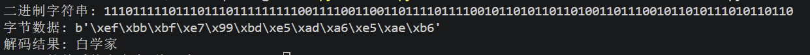 


输入密码（这里直接使用binwalk提取出来的压缩包，然后用7-zip输入密码）

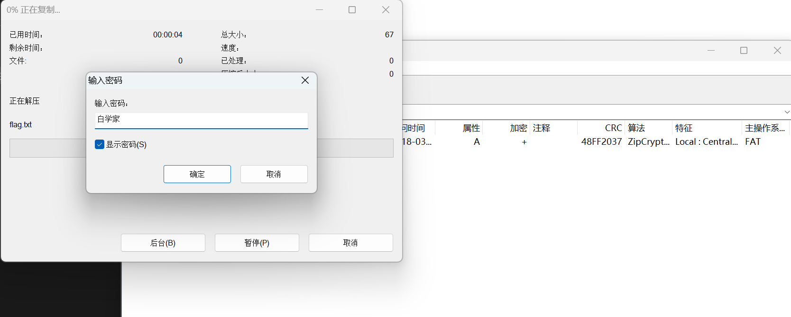 

打开后就是flag了

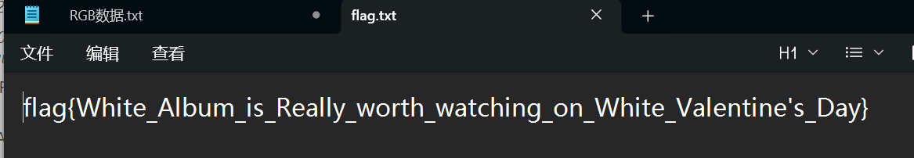 

再按照要求把引号去掉得到最后的结果flag{White_Album_is_Really_worth_watching_on_White_Valentines_Day}


## 好像说太多了  [Xp0intCTF](https://ctf.bugku.com/challenges/index/gid/2/tag/106.html) [2017](https://ctf.bugku.com/challenges/index/gid/2/tag/107.html)

1、词频分析


打开文件得到密文

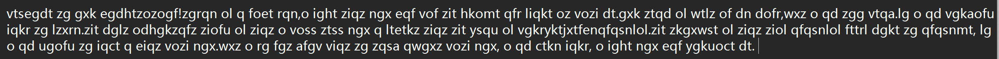 

这个一开始以为是移位密码，但是这里发现好像见过，拖进去工具后反应过来有点像词频分析[quipqiup - cryptoquip and cryptogram solver](https://quipqiup.com/)

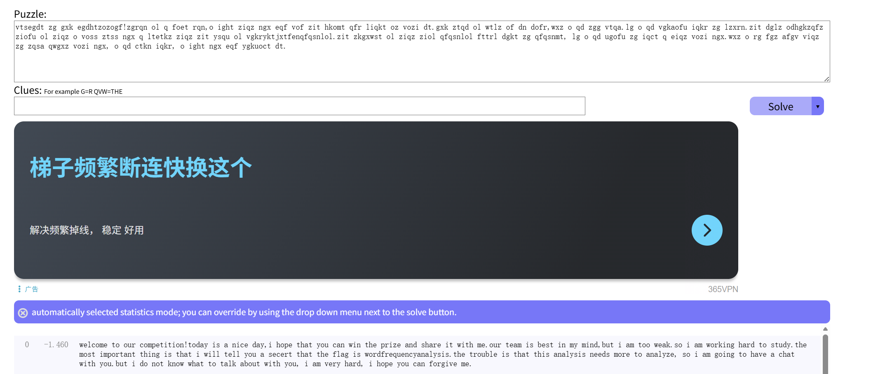 

没想到直接就得到了flag

```
flag{wordfrequencyanalysis}
```


## 一个普通的压缩包  [Xp0intCTF](https://ctf.bugku.com/challenges/index/gid/2/tag/106.html) [2017](https://ctf.bugku.com/challenges/index/gid/2/tag/107.html)

1、修复RAR文件

2、png改gif提取图片

3、stegsolve切换通道得到两个二维码

4、二维码凭借后读取flag


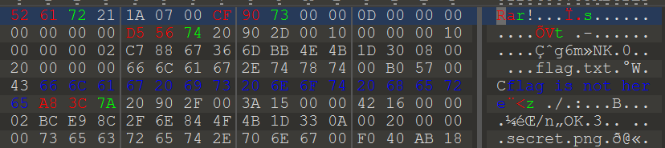 

打开后很明显看到是有两个文件，一个是flag.txt,一个是secret.png，但是打开压缩包却发现只能解压处txt文件，但是里面什么都没有

将第二个文件的块结构的7A改为74即可

> [!IMPORTANT]
>
> 对比flag.txt文件可以知道
>
> 1、D5 56 74其中D5 56表示第一个文件的crc校验值 0x56D5 ,74表示为块类型
>
> 2、第二个文件的A8 3C 7A也是一样的结构，CRC校验值为0x3CA8 ,7A这里应该为74，也表示块类型

改完后导出来

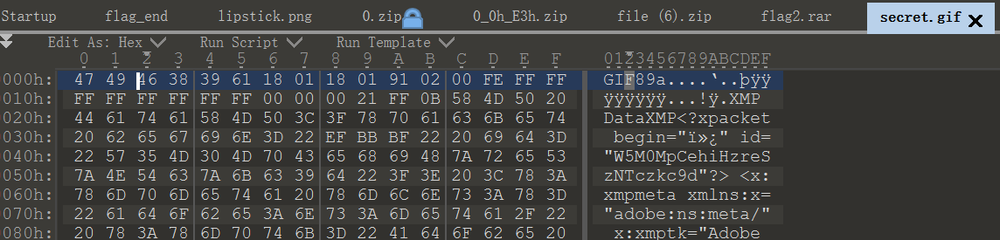 

查看编码，发现是gif格式，将其改完后提取帧得到两张图片

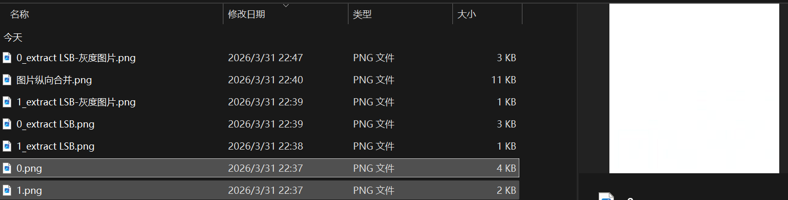 

都是空白的，拖进stegslove切换通道看到二维码

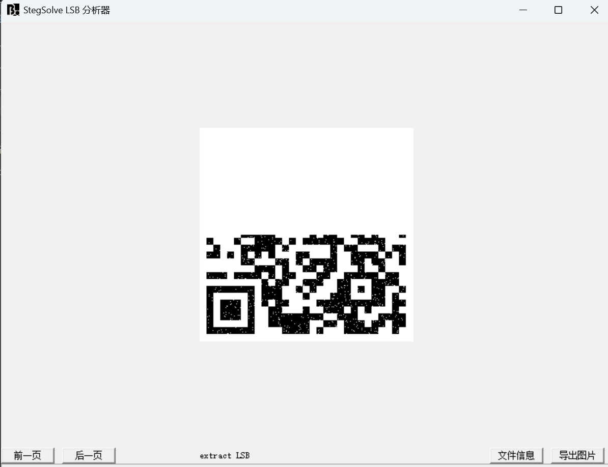 

两张图片分别是上半部分和下半部分

拼接一下

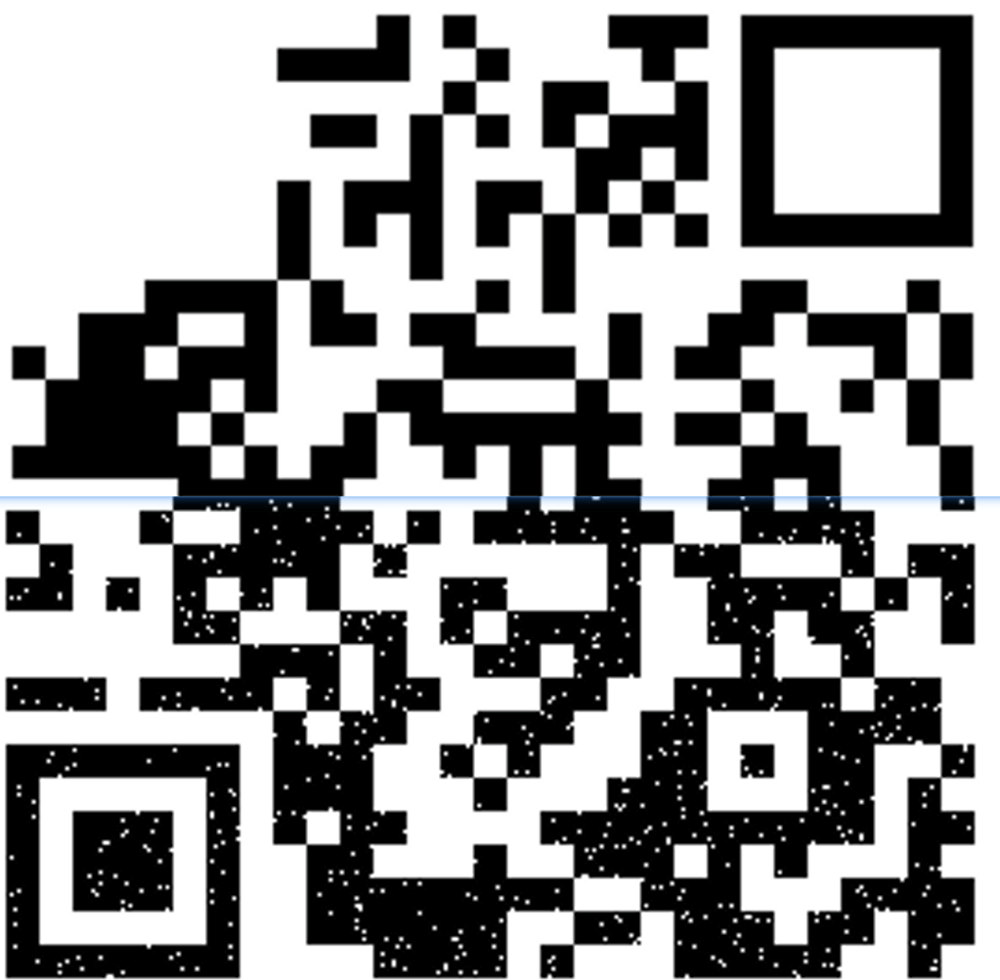 

然后把二维码补充完全，使用随波逐流就行

 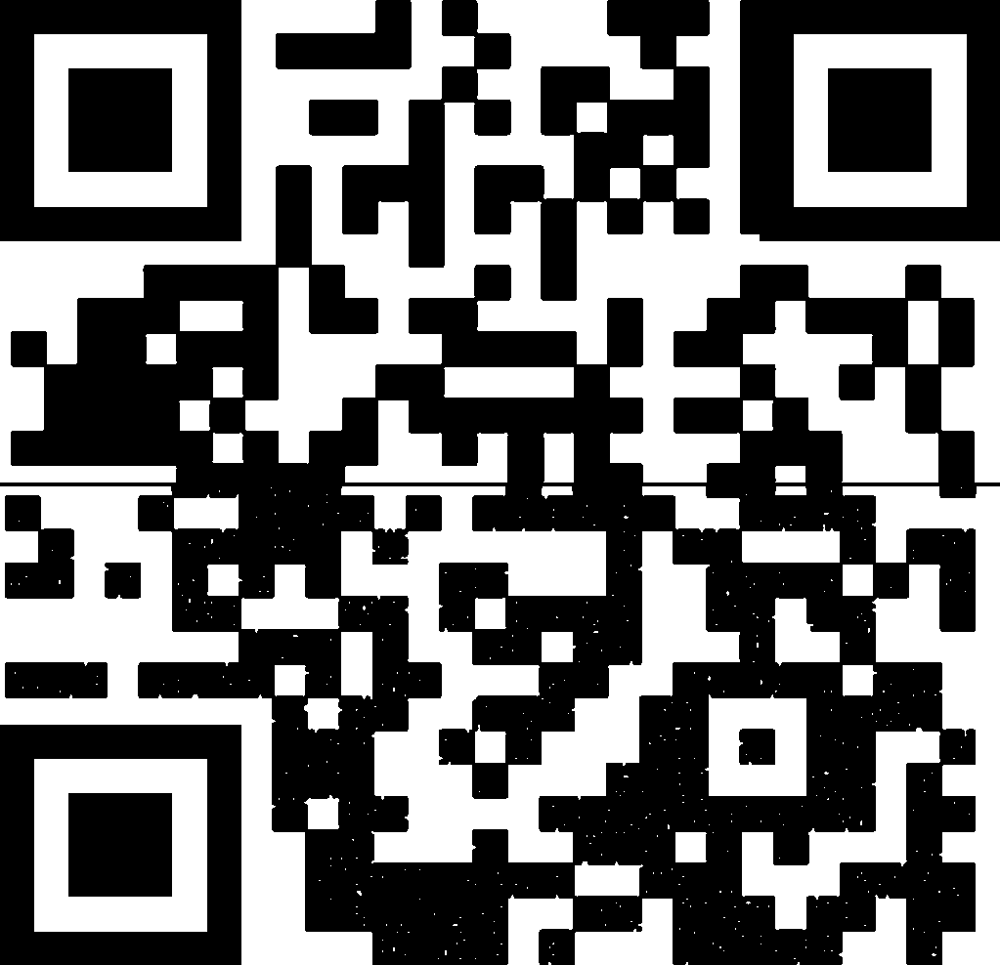

直接读取得到flag

```
flag{yanji4n_bu_we1shi}
```


## 薛定谔的猫  

1、提取010中的数据找到代码

2、提取base64部分解码后得到flag

直接解压提取没有信息，010打开发现python代码

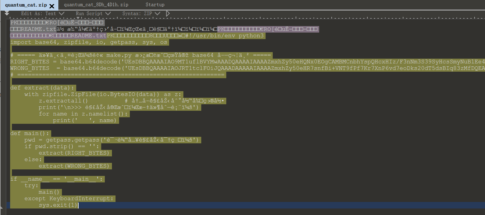 

对RIGHT_BYTES进行解码后是一个zip文件，打开后就是flag

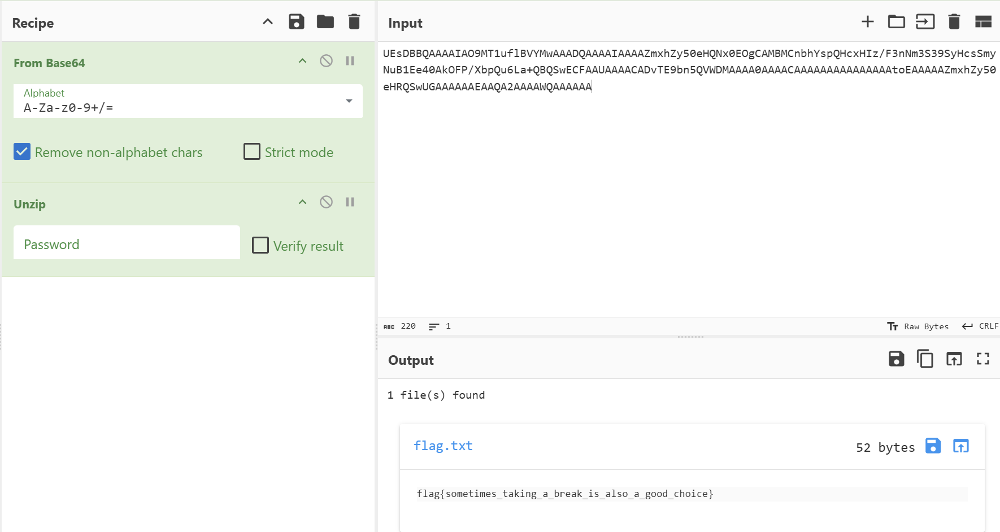 

```
flag{sometimes_taking_a_break_is_also_a_good_choice}
```


