## 重重flag背后隐藏的秘密    [Xp0intCTF](https://ctf.bugku.com/challenges/index/gid/2/tag/106.html) [2017](https://ctf.bugku.com/challenges/index/gid/2/tag/107.html)

1、把字符串换行  --方便字符串正则查找

2、使用正则匹配查找字符串


使用代码自动匹配flag，然后分行保存

```python
import re

file_path = r"C:\Users\asus\Downloads\file (7)\my_flag.txt"
output_path = r"C:\Users\asus\Downloads\file (7)\flags1.txt"

with open(file_path, "r", encoding="utf-8") as f:
    content = f.read()
#匹配字符串
flags = re.findall(r"flag\{.*?\}", content)

with open(output_path, "w", encoding="utf-8") as f:
    for flag in flags:
        print(flag)
        f.write(flag + "\n")

print("已保存，每个flag一行")
```

保存后使用010打开，输入正则表达式匹配

```
flag{[0-9]{3}[A-Z].*[A-Z].[0-9]}
```

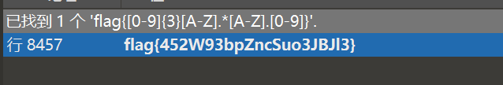 

```
flag{452W93bpZncSuo3JBJl3}
```


## 弗拉戈在哪里2  [Xp0intCTF](https://ctf.bugku.com/challenges/index/gid/2/tag/106.html) [2017](https://ctf.bugku.com/challenges/index/gid/2/tag/107.html)

010直接得到结果

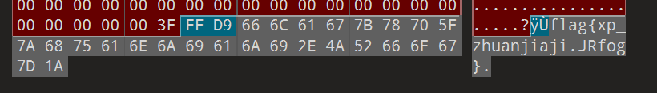 

```
flag{xp_zhuanjiaji.JRfog}
```


## 弗拉戈在哪里  [Xp0intCTF](https://ctf.bugku.com/challenges/index/gid/2/tag/106.html) [2017](https://ctf.bugku.com/challenges/index/gid/2/tag/107.html)

1、解压后得到压缩包丢进010

2、翻看数据得到一个base64编码  --解码后得到flag


压缩包丢进去010，找到base64编码

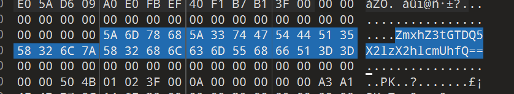 

解码后就是flag

```
flag{FL49_is_here!}
```


## 犯人留下了信息 [Xp0intCTF](https://ctf.bugku.com/challenges/index/gid/2/tag/106.html) [2017](https://ctf.bugku.com/challenges/index/gid/2/tag/107.html)

1、频域盲水印（python2)

打开文件后是两张看起来一样的图片，文件比较后可以发现有条纹

 

这个就属于是盲水印了，一开始使用的工具都没有提取出来有用信息，后面使用puzzlesolove提取出来了

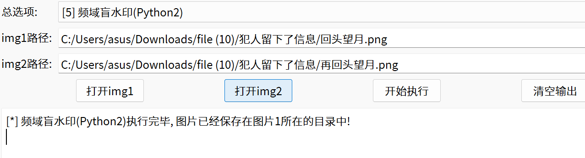 


切换四个不同的盲水印提取，最后在python2频域里面找到了

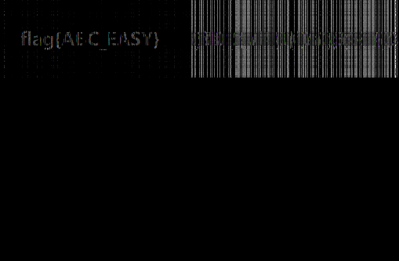 

```
flag{ABC_EASY}
```


## 请攻击这个压缩包  [Byxs20](https://ctf.bugku.com/user/info/id/53292.html)

1、使用brack明文攻击  --得到文件压缩包

2、直接提取图片数据得到flag


使用archpr无法打开这个压缩包，尝试爆破和伪加密都是显示无效，使用明文攻击也是无法显示

后面切换为brack 进行攻击

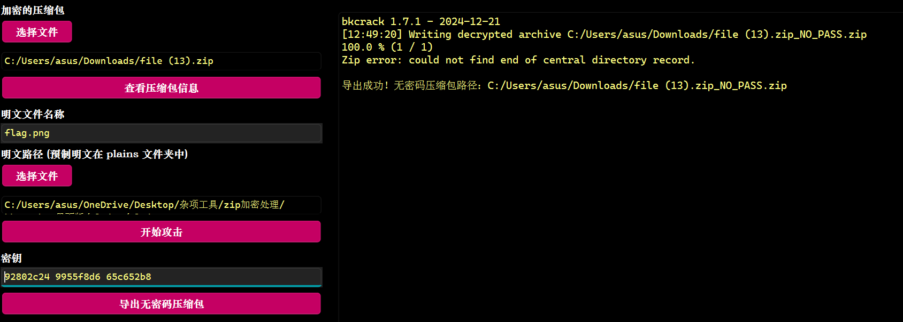 

得到文件后一开始还以为是输出压缩包文件，使用010才发现直接把文件输出了

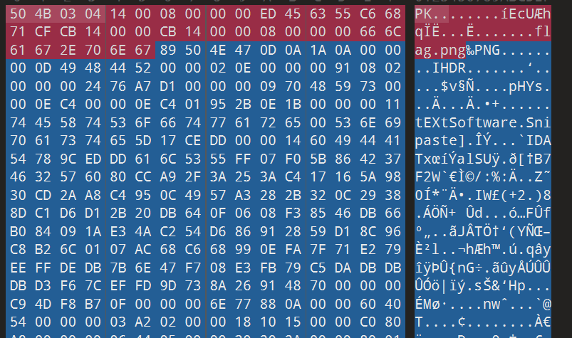 

直接导出png的字节，然后保存为png后缀

.zip_NO_PASS_26h_14CBh.png) 

```shell
BugKu{不是非得两个文件你才能明文攻击}
```


## 流量分析MISC  [鹤城杯](https://ctf.bugku.com/challenges/index/gid/2/tag/228.html) [2021](https://ctf.bugku.com/challenges/index/gid/2/tag/229.html)

1、导出http流，观察注入

2、对注入成功的提取注入数字

3、10进制转ascll字符


whireshark打开流量，按照长度排序

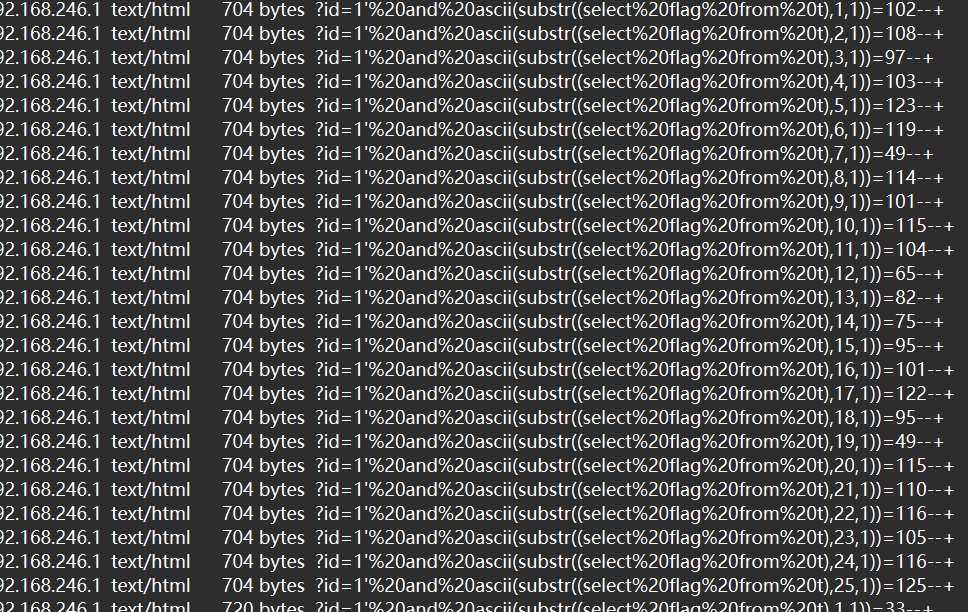 

得到102开头的流量

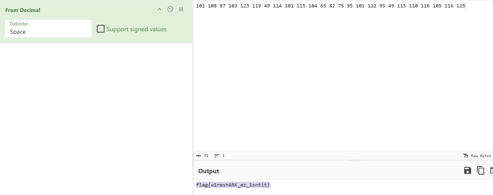 

对提取的数字转编码

```
flag{w1reshARK_ez_1sntit}
```


## New MISC[鹤城杯](https://ctf.bugku.com/challenges/index/gid/2/tag/228.html) [2021](https://ctf.bugku.com/challenges/index/gid/2/tag/229.html)

1、wbStego4open直接无密码提取PDF


打开软件，第二步选择decode 第三步选择pdf,选择输入文件

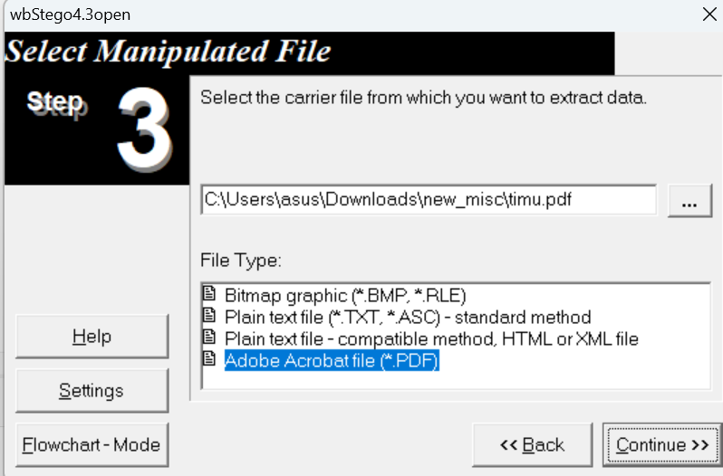 

第四步输入密码，但是这里没有密码，所直接下一步

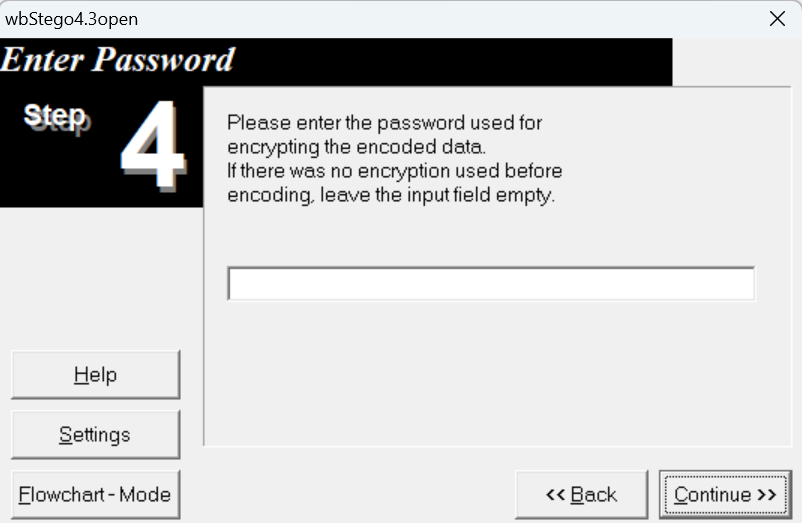 

第五步这里选择输出文件

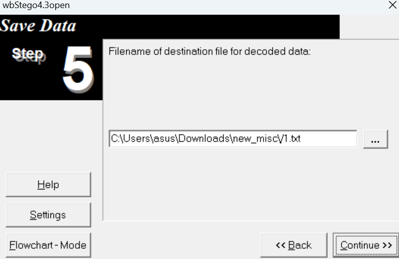 


## MISC2[鹤城杯](https://ctf.bugku.com/challenges/index/gid/2/tag/228.html) [2021](https://ctf.bugku.com/challenges/index/gid/2/tag/229.html)

1、lsb提取数据  --得到html编码

2、解码得到flag


lsb发现以下内容，导出文件

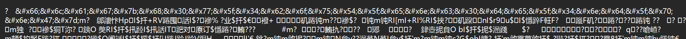 

对前面的编码破解得到flag

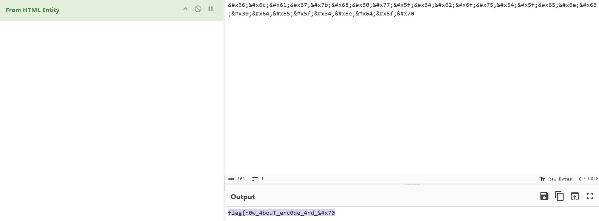 

```
flag{h0w_4bouT_enc0de_4nd_pnG}
```


## Linux2  [Linux2 - Bugku CTF平台](https://ctf.bugku.com/challenges/detail/id/19.html)

1、使用7-zip打开文件

2、查找到体积较小的文件  --得到flag


给的文件没有线索，使用7-zip后发现能打开

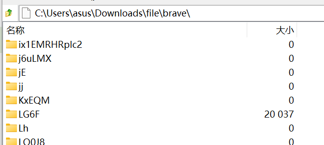 

打开几个文件后找到一个大小 不对劲的文件夹

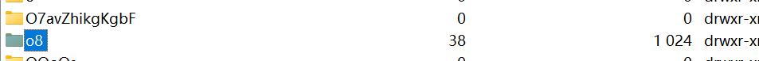 

打开后得到flag文件

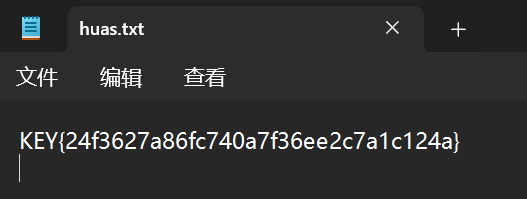 

```
KEY{24f3627a86fc740a7f36ee2c7a1c124a}
```

