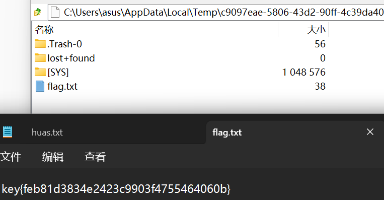
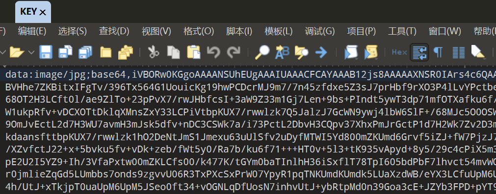
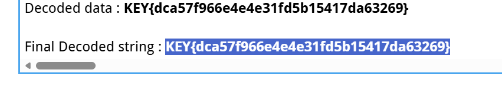

## linux  [linux - Bugku CTF平台](https://ctf.bugku.com/challenges/detail/id/15.html)

1、使用7-zip找到最深层文件得到flag




```
key{feb81d3834e2423c9903f4755464060b}
```


## 多种方法解决  [多种方法解决 - Bugku CTF平台](https://ctf.bugku.com/challenges/detail/id/11.html) 

1、使用010发现是图片base64编码  --转为图片是个二维码

2、提取后得到flag


010打开发现是base64



转码后

   

直接识别



```
KEY{dca57f966e4e4e31fd5b15417da63269}
```

