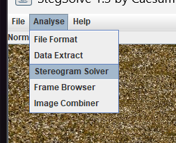
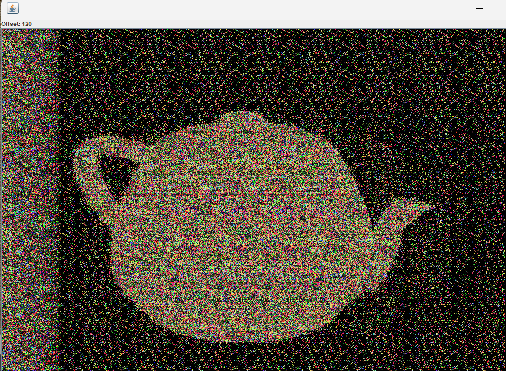
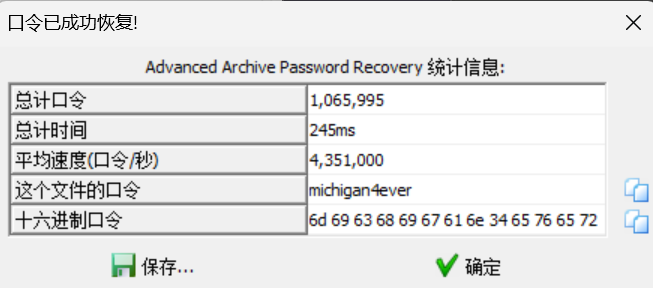
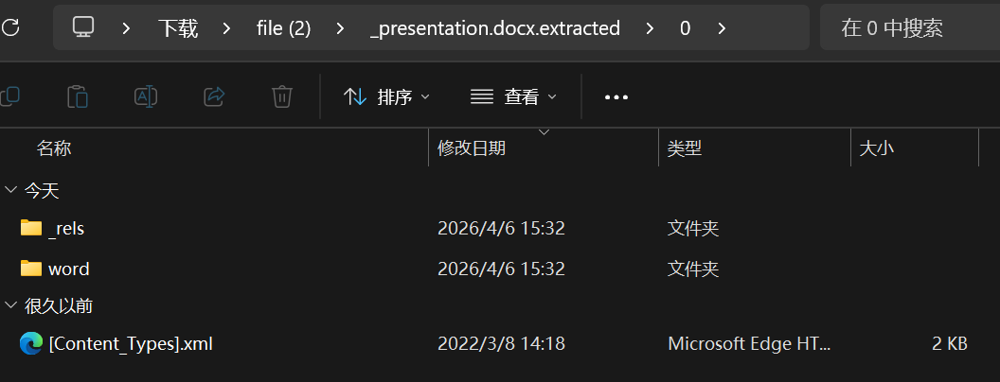
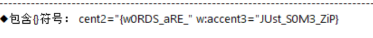
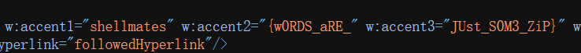

## abstract_art  [WolvCTF](https://ctf.bugku.com/challenges/index/gid/2/tag/96.html) [2023](https://ctf.bugku.com/challenges/index/gid/2/tag/97.html)

1、使用stegsolve打开图片

2、切换到steregram,打开到120页

3、翻译图片的英文为flag


打开syteggra

 


当切换到120的时候出现一个茶壶

 

将其茶壶翻译为英文teapot得到flag

```shell
wctf{teapot}
```


## we_will_rockyou [WolvCTF](https://ctf.bugku.com/challenges/index/gid/2/tag/96.html) [2023](https://ctf.bugku.com/challenges/index/gid/2/tag/97.html)

1、字典爆破

根据题目里面的提示，使用rockyou字典对压缩包进行爆破

 

得到密码michgan4ever

最后得到flag

```shell
wctf{m1cH1g4n_4_3v3R}
```


## Hello word   [HackINI](https://ctf.bugku.com/challenges/index/gid/2/tag/98.html) [2022](https://ctf.bugku.com/challenges/index/gid/2/tag/100.html)

1、将docx改为zip解压

2、对解压文件进行查找，得到flag


改为zip解压后得到若干xml文件

 

对文件一个一个放入随波逐流分析

 

然后在word\settings.xml里面找到类似于flag的字符串

 

将accent的三部分拼接后得到flag

```shell
shellmates{w0RDS_aRE_JUst_S0M3_ZiP}
```

