# 流量分析

## 编码flag--可恶的黑客

1、导出http流

2、根据http流中线索找到关键流量

3、在流量中找到flag的html编码

导出http流后，在第79.php中找到线索

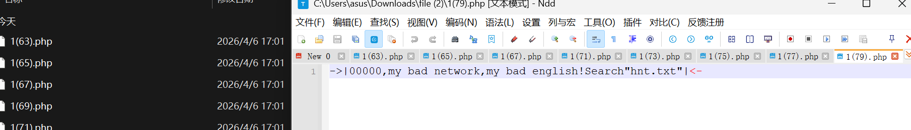 

```shell
->|00000,my bad network,my bad english!Search"hnt.txt"|<-
```

检索后追踪流得到一串关键编码

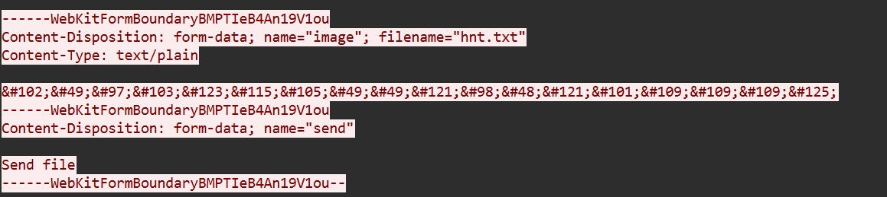 

```shell
&#102;&#49;&#97;&#103;&#123;&#115;&#105;&#49;&#49;&#121;&#98;&#48;&#121;&#101;&#109;&#109;&#109;&#125;
```

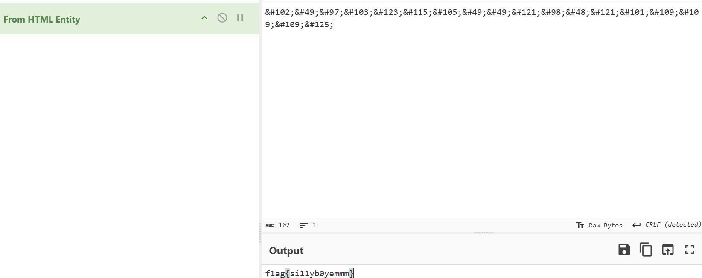 

```shell
f1ag{si11yb0yemmm}
```


## 压缩包flag --test

1、使用binwalk提取压缩包

当压缩包为gz的格式时，无法使用7-zip直接打开，需要使用binwalk提取出来

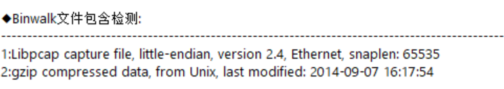 

提取后直接打开即可

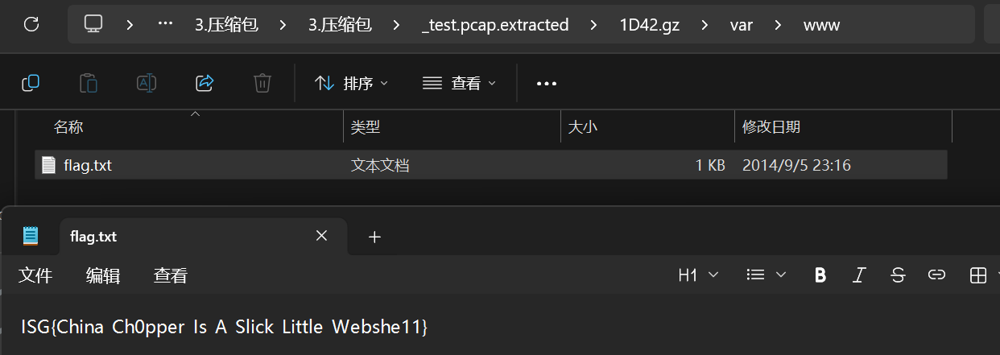 

```shell
ISG{China_Ch0pper_Is_A_Slick_Little_Webshe11}
```


## 菜刀+压缩包  --liuliang

1、提取压缩包

2、伪加密破解压缩包

文件导出来http流之后在test27里面提取到压缩包

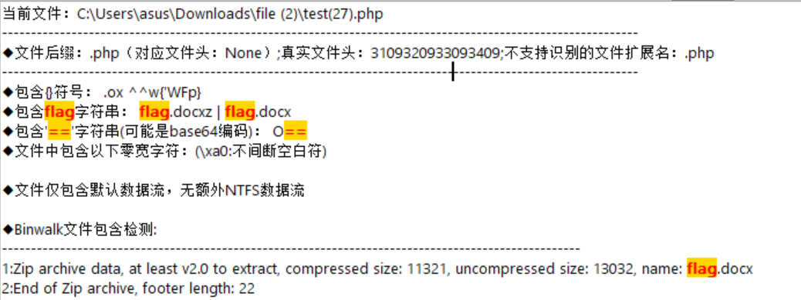 

压缩包放入随波逐流提取到伪加密修复文件，最后得到flag

```
2d6cb5b69212296f964dbc4f21171570
```


## 无线流量  --ctf

1、使用airdecap爆破得到密码

2、使用密码生成新文件得到flag

打开流量包如下所示：

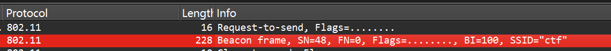 

说明为wifi无线流量

使用aircrack破解密码

```shell
user@WIN-5AM5FNE9G4E:~$ aircrack-ng -w "/mnt/d/CTF/爆破字典/弱口令字典/passwd-CN-Top10000.txt" "/mnt/d/CTF-L/流量分析/1.以前及收集/1-20/11.无线流量/11.无线流量/ctf.pcap"

格式：aircrack-ng -w "字典" "流量包"
```

破解后得到密码

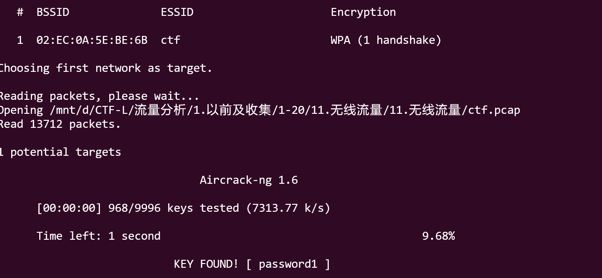 

```shell
wifi名称：ctf
密码：password1
```

再次使用aircrack破解出流量包

```shell
user@WIN-5AM5FNE9G4E:~$ airdecap-ng -e "ctf" -p password1 "/mnt/d/CTF-L/流量分析/1.以前及收集/1-20/11.无线流量/11.无线流量/ctf.pcap"

格式： airdecap-ng -e "WiFi名称" -p WiFi密码 "流量包“
```

解出来后生成一个新的流量包

 

搜索后得到flag

```shell
flag{H4lf_1s_3n0ugh}
```


## 冰蝎流量 --初赛traffic_hunt

1、流量分析发现关键请求包 /favicondemo.ico

2、对所有http流分析，发现在请求第一次发送favicondemo.ico的文件中包含一个密码

3、对后面的流量反编译发现是冰蝎流量

4、对最后一次的favicondemo.ico包追踪后破解冰蝎流量得到关键命令

5、提取到密钥之后，对后面的通行进行破解

7、破解后将得到的字符串解密得到flag

导出http流中发现大量favicondemo.ico文件

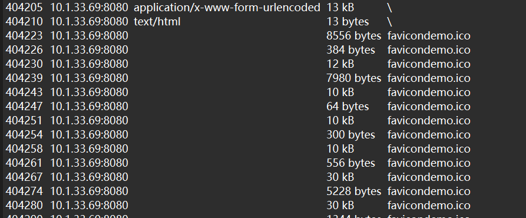 

分析http流中的favicondemo.ico文件

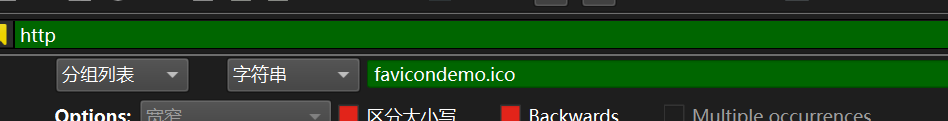 

在第一个上传的文件中发现一个密钥

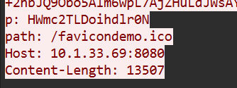 

```shell
p:HWmc2TLDoihdlr0N
```

在后面的请求中，对其解密后发现是java的class文件
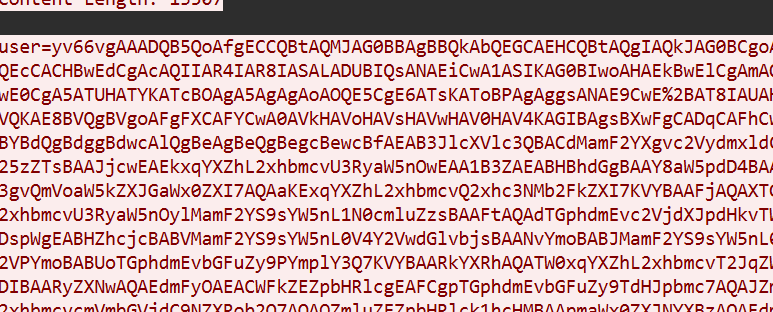

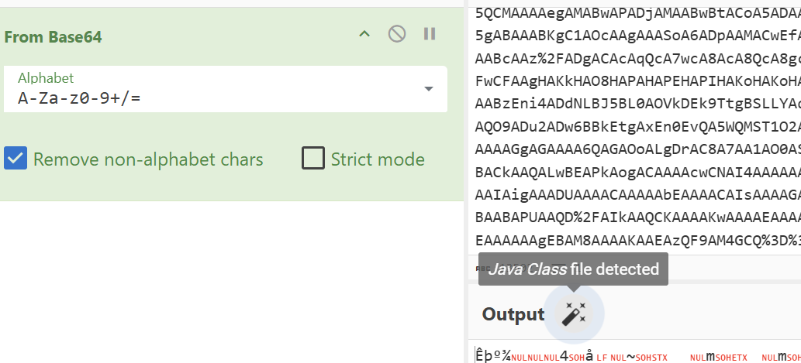 

拖入工具中反编译

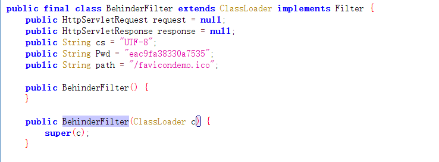 

发现是冰蝎流量

> [!IMPORTANT]
>
> 冰蝎加密
>
> 流量连接请求是通过 bash64加密两次 AES加密
> 流量解密过程： 解AES密钥为(连接密码的MD5的前16位) --> 解base64两次

将前面得到的密钥转为MD5取前16位得到AES密钥

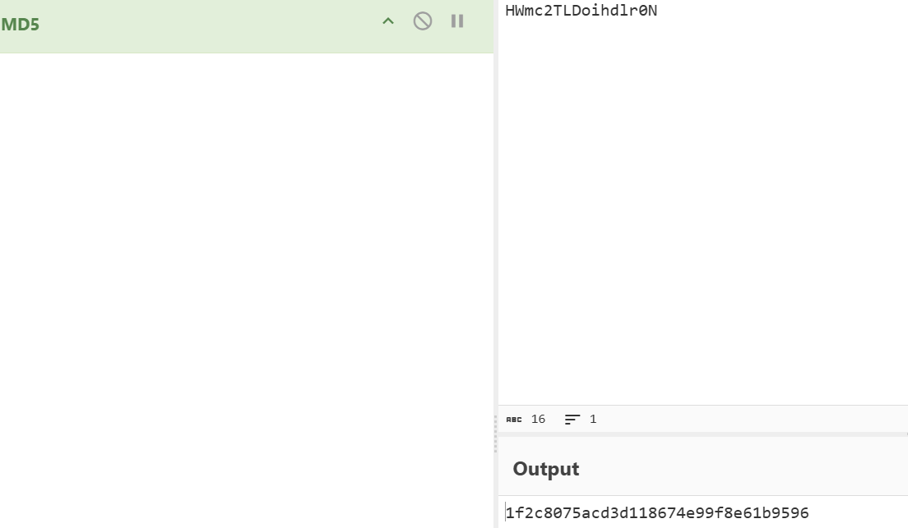 

```shell
1f2c8075acd3d118
```

在最后一次的favicondemo.ico的请求中（tcp.stream 40562），对流量破解后得到一段关键命令

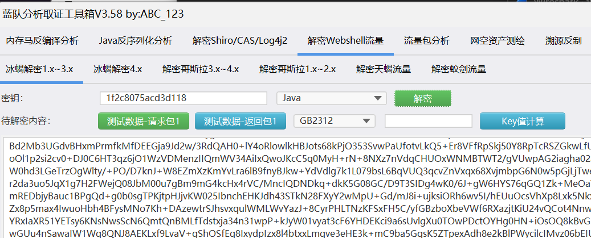 

反编译后得到后面通信的加密密钥：

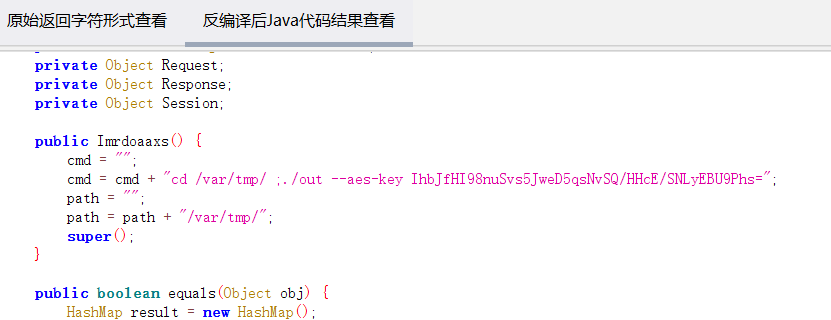 

```shell
 cmd = cmd + "cd /var/tmp/ ;./out --aes-key IhbJfHI98nuSvs5JweD5qsNvSQ/HHcE/SNLyEBU9Phs=";
 密钥：IhbJfHI98nuSvs5JweD5qsNvSQ/HHcE/SNLyEBU9Phs=
```

对后面的流量（40563）转为原始字节后进行反编译：

```shell
### 解密 implant 通信流（tcp.stream 40563）
该流协议为：
- 小端 4 字节长度前缀
- 后跟 AES-GCM 密文包（`nonce(12) + ciphertext + tag`）
```

```python
import struct
import base64
from Crypto.Cipher import AES

hex_data = """
1f00000033740a2c22b1e703d2f1480b321f3e4cdc8eb50da84ca0a76543b6bbadf60a
240000005c8a2365d717d71114b7be5599d5cfff553f2f0b2251505c3f5ada10a77be1bf35852f9c
1e000000e3ee79aaf91b813d407e18095278046d32c10567fe57d60459d32f6df234
1f000000bd345efc1465b04f38a410a09ed999e9849a570c27dd75e8d6b8aac5a4f22f
30000000be53ef2dc360548f22bd7145f4e1733ffeb228db69b28e76ccb65ea9d8e33a709cfae6579a795f4045dbc2f6300cd871
2b0000002b7991ad1cfcb2c0b334f5ee5cfb1be844f232c5062190e5e7bfb2208ef40aec6cff1aa7df01285fd3a92a
6e0000008ac33897541bf959bb223309ffa07a25c49245bb988404180f84d7baef2c2ca8dfd669d39d3fa9c9e66b3da81834c7121cad53ffb16b38dcb062b2b3ce1b634f3bac9ed6e161661efb67ab754eb078718c484cb1b9ec873a103035fdc0b28ed418aa11e68b561599b9685ae54b95
690000005fb656ee12487f33e75202b3bec1a6728977618d6b221fb887fa90d36cb5ff75949c1ae90608e22fc81a12fb2e576dd2df4330fcbf619b19455dcfe6c9ae2a8e730cf9010dcc3a15f04bec1fa70b051792d4e197cee0f075405b366472711d1d94f5bb349348bf05d5
24000000410d930f46d9e71c2200eb1fc4ec9986fd2d72ab2c35aa85fe66fa664a3729e3e9a906b6
1f0000007ccb9636b4b330000914519540b5a3b0bacb6f594c3b03ff582d62084c1af4
"""

data = bytes.fromhex(hex_data)

key = base64.b64decode("IhbJfHI98nuSvs5JweD5qsNvSQ/HHcE/SNLyEBU9Phs=")

offset = 0
i = 0

while offset < len(data):
    length = struct.unpack("<I", data[offset:offset+4])[0]
    offset += 4

    packet = data[offset:offset+length]
    offset += length

    nonce = packet[:12]
    tag = packet[-16:]
    ciphertext = packet[12:-16]

    cipher = AES.new(key, AES.MODE_GCM, nonce=nonce)
    plaintext = cipher.decrypt_and_verify(ciphertext, tag)

    print(f"[{i}] {plaintext.decode(errors='ignore')}")
    i += 1
```

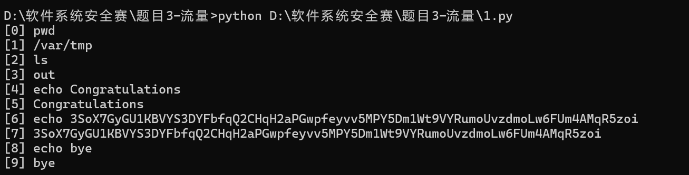 

得到字符串

```shell
3SoX7GyGU1KBVYS3DYFbfqQ2CHqH2aPGwpfeyvv5MPY5Dm1Wt9VYRumoUvzdmoLw6FUm4AMqR5zoi
```

解密后得到flag

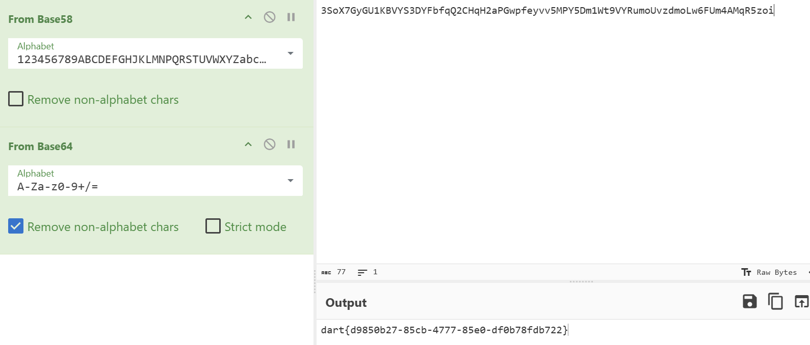 

```shell
dart{d9850b27-85cb-4777-85e0-df0b78fdb722}
```

